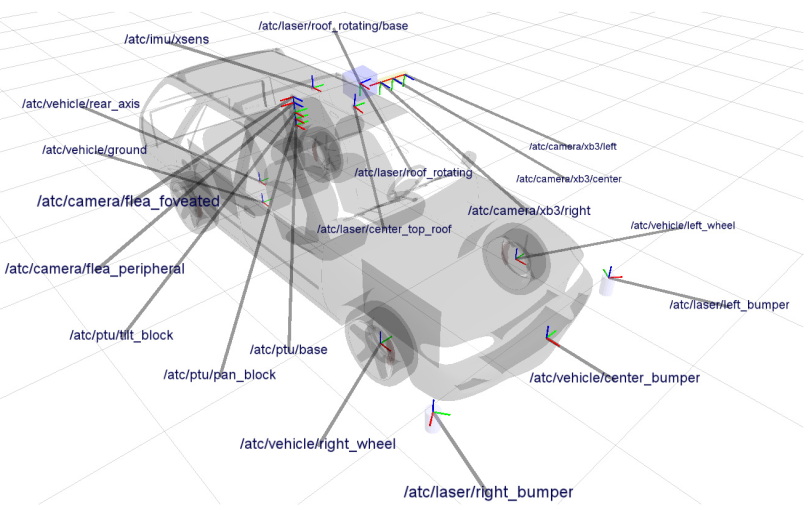
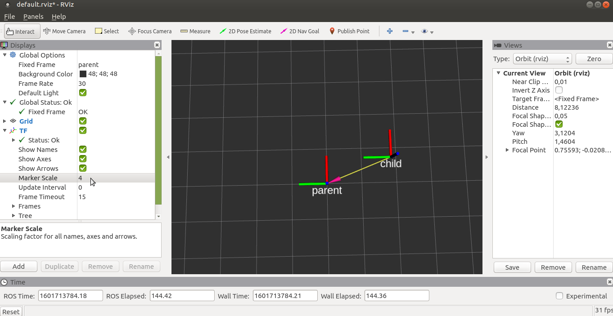
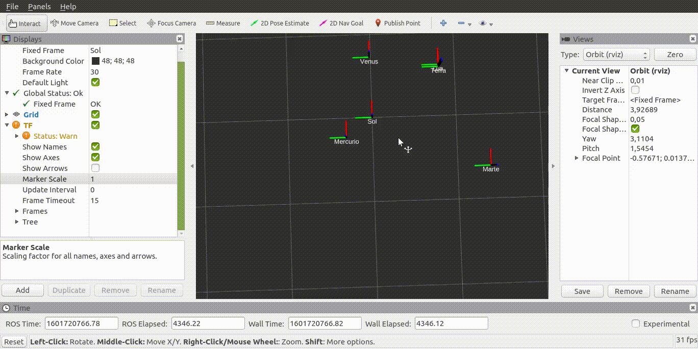
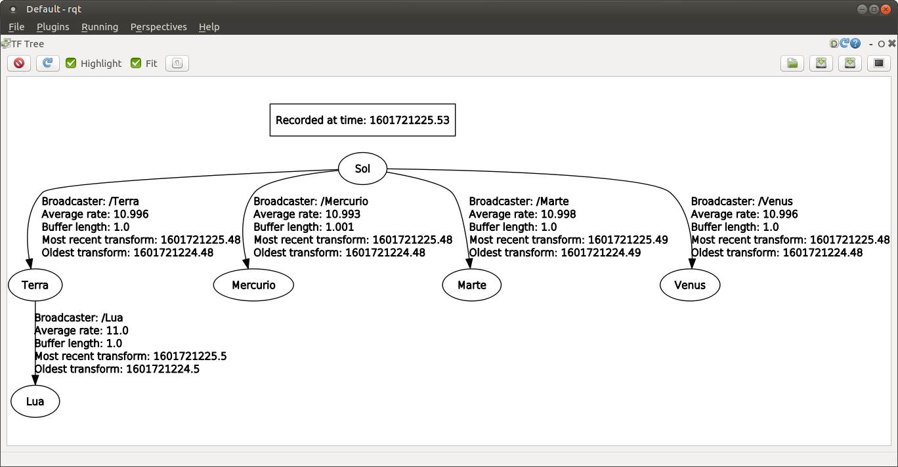
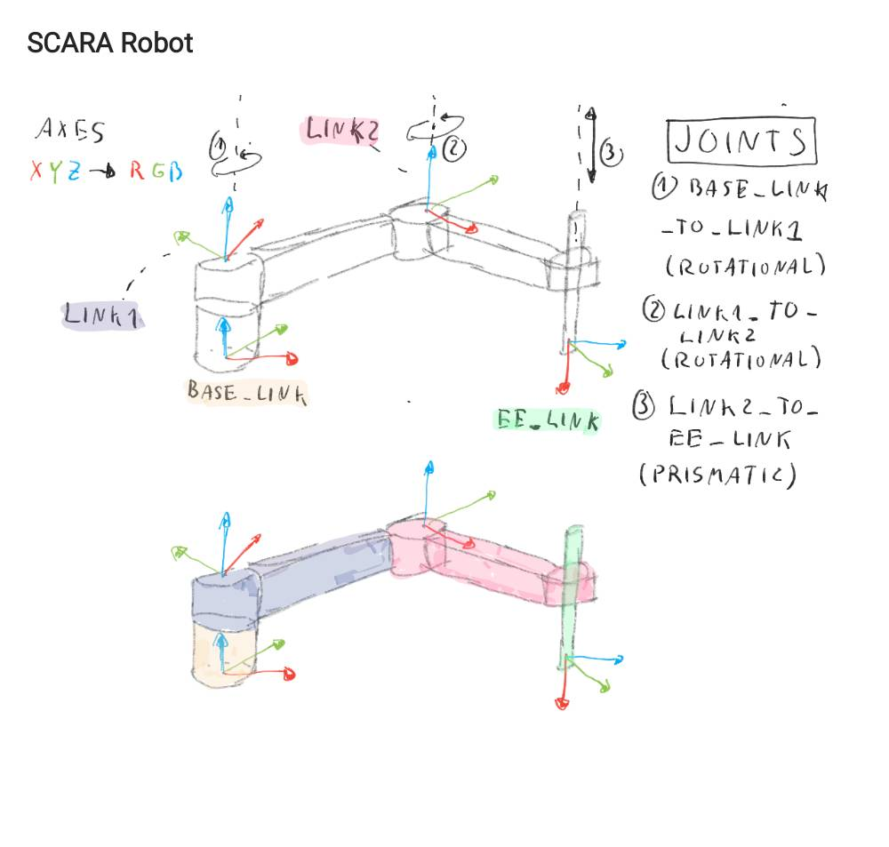
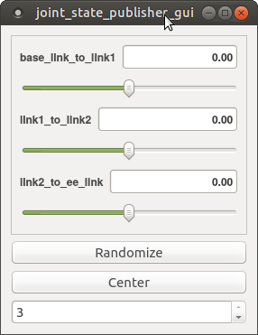

= Parte 11 - PSR

Miguel Riem Oliveira <mriem@ua.pt>
2022-2023

// Instruções especiais para o asciidoc usar icons no output
:icons: html5
:iconsdir: /etc/asciidoc/images/icons
:stem: latexmath

.Sumário
-------------------------------------------------------------
Transformações geométricas em ROS
Visualização de transformações geométricas
Robot State Publisher
Robot Description
URDF e Xacro files
-------------------------------------------------------------

[WARN]
================
Visualize primeiro https://youtu.be/xm_otUvbaX8[esta exposição] teórica sobre matrizes de tranformação geométricas e a sua aplicação em ROS.
================

A bilioteca em ROS que implementa o sistema de transformações geométricas distribuídas chama-se **tf**,
e vai já na segunda versão (**tf2**). Por convenção, as transformações que estão no sistema são todas publicadas no tópico _/tf_.
Os publicadores de transformações chamam-se _transform publishers_, e os nós que pretendem obter informação sobre as transformações são os _transform listeners_.
Quando se instancia um transform listener o nó subscreve  o tópico _/tf_ e sempre que recebe uma mensagem com transformações atualiza o buffer local de transformações.
Para obter uma transformação utiliza-se a função **lookupTransform**, que utiliza esse buffer local e a metodologia exposta na explicação teórica para obter a transformação solicitada.

Os sistemas robóticos podem por vezes ter àrvores bastante complexas, com dezenas de transformações encadeadas umas nas outras.
Em baixo um exemplo do AtlasCar e as todos os sistemas de referência considerados para este sistema.

[.text-center]
.Os sistemas de coordenadas definidos para o AtlasCar.

Exercício 1 - tutoriais tf2
---------------------------

Faça os tutoriais de http://wiki.ros.org/tf2/Tutorials[tutoriais de tf2] para python.

Exercício 2 - Criação de uma àrvore de transformações
-----------------------------------------------------

Escreva um nó python chamado _circular_frame.py_ que utiliza os parâmetros locais _parent_ e _child_ para publicar periodicamente
a transformação de _parent_ para _child_ de modo a que o sistema de refência _child_ se mova em circulos à volta da origem de _parent_.

Confirme com o RViz que as transformações estão a ser publicadas. Pode adicionar dois displays do tipo _Axes_, uma para o _parent_ e outro para o _child_,
ou em alternativa utilize o display _TF_ que visualiza todas as transformações no sistema.

[.text-center]
.Exemplo do RViz neste exercício.

Exercício 3 - Publicação de transformações
------------------------------------------

Escreva um launch file que lance nós a partir do código do exercício anterior.
Esses nós devem ter os nomes dos planetas internos (telúricos) do sistema solar (Mercúrio, Venus, Terra e Marte) e seus satelites, e devem estar encadeados de acordo com as órbitas de cada um.
Quer isto dizer que por exemplo a Terra deverá ter como sistema de coordenadas pai o Sol, e que a Lua deverá ter como sistema de coordenadas pai a Terra.

Assuma as seguintes simplificações (aproximação de engenheiro):

    . As órbitas como sendo circulares;
    . Não são considerados os dois satelites de Marte, Phobos e Deimos;
    . Assuma que o sistema solar é planar (z=0).

Aqui tem a https://nssdc.gsfc.nasa.gov/planetary/factsheet/planet_table_ratio.html[informação necessária] sobre as distâncias dos planetas ao corpo celeste em torno do qual orbitam.
Visualize também a àrvore de transformações usando o rqt ou as ferramentas do package _tf_.

[.text-center]
.Um exemplo da visualização pretendida.

[.text-center]
.Àrvore de transformações para o sistema solar.

[WARN]
==========================
Para efeitos de melhor visualização, recomenda-se que multiplique por 0.01 todas as velocidades, e que multiplique por 10 a distância da terra à lua.
==========================

Exercício 4 - Leitura de transformações
---------------------------------------

Escreva um nó em python chamado _mercury_to_moon.py_ que verifique periodicamente a distância de Mercúrio à Lua e a imprima no terminal.

Exercício 5 - Universal Robot Description Format
------------------------------------------------

O **U**niversal **R**obot **D**escription **F**ormat é o standard para representação de robôs usado pelo ROS.
Os robôs são descritos como uma cadeia cinemática, ou seja, uma àrvore de sistemas de coordenadas ligados por transformações.
estáticas ou móveis. Em URDF is sistemas de coordenadas são os _link1_ e as transformações podem ser obtidas através da informação contida nas _joints_.

Para se ambientar com a sintaxe do URDF http://wiki.ros.org/urdf/Tutorials/Building%20a%20Visual%20Robot%20Model%20with%20URDF%20from%20Scratch[faça este tutorial] e http://wiki.ros.org/urdf/Tutorials/Building%20a%20Movable%20Robot%20Model%20with%20URDF[também este].

=========================
Os tutoriais para URDF estão em: http://wiki.ros.org/urdf/Tutorials
=========================

Exercício 6 - Um Robô Scara
---------------------------

Os robôs SCARA são robôs com cadeias cinemáticas simples, tipicamente compostas por duas juntas rotacionais seguidas de uma junta prismática.
Quase todas as grandes marcas têm SCARAs disponíveis no mercado, como é o caso da https://www.fanuc.eu/pt/pt/rob%c3%b4s/p%c3%a1gina-filtro-rob%c3%b4s/scara-series/scara-sr-12ia[FANUC] ou da https://new.abb.com/products/robotics/industrial-robots/irb-910sc[ABB].

Escreva um ficheiro _scara.urdf_ do robô scara esquematizado na figura. Siga os nomes especificados no esquema e invente os valores que considerar adequados para o comprimento dos elos, largura, etc.

[.text-center]
.Um esquema de um robô scara e da sua cadeia cinemática.

=================
Crie um novo package ROS psr_parte11_scara_description (<robot_name>_description é o nome habitualmente dado aos packages que contêm os ficheiros URDF).
Dentro desse package crie uma pasta urdf e coloque o ficheiro URDF lá dentro.
=================

Para validar o urdf pode correr o comando:

    rosrun urdfdom_py display_urdf scara.urdf

Exercício 7 - Robot State Publisher
-----------------------------------

Como vimos acima, a descrição URDF de um robô contem _links_ ligados entre si por _joints_. Se uma junta for estática, então a transformação geométrica que lhe corresponde é calculada uma vez e será sempre conhecida.
No caso de a junta ser dinâmica é necessário recalcular a cinemática direta do robô para cada novo valor de junta recebido.

O **robot_state_publisher** é o nó ROS responsável por realizar este processo. Este nó subscreve mensagens com o valor das juntas (_sensor_msgs/JointState_) e sempre que uma junta é  atualizada recalcula a transformação geométrica associada e
publica a transformação resultante no tópico _/tf_.

Este nó é muito flexível, visto que consegue derivar a cinemática direta de qualquer robô a partir da descrição do ficheiro URDF.
O nó não lê o ficheiro URDF mas sim um parâmetro ROS denominado **/robot_description** (por convenção) criado a partir desse ficheiro. Para criar o parâmetro _/robot_description_ a partir do urdf pode fazer:

    rosparam set /robot_description "`rosrun xacro xacro scara.urdf`"

As plicas (``) indicam à _shell_ que deve recolher o resultado do comando, e não o texto literal.

Pode agora lançar o **robot_state_publisher**:

    rosrun robot_state_publisher robot_state_publisher

e um nó para verificar se o **robot_state_publisher** está a publicar transformações, e.g.:

    rostopic echo /tf

Verificará que ainda não há transformações no sistema. A razão é a de que, como discutido acima, o **robot_state_publisher** necessita de valores de juntas para depois calcular (e publicar) as transformações.

Num sistema real (neste momento estamos a simular um robô) haveriam outros nós ROS responsáveis por fazer a interface com o hardware e publicar os valores medidos das juntas (estes nós tipicamente são chamados de _drivers_).

Neste caso devemos então substituir os _drivers_ que não estão presentes, lançando o _joint_state_publisher_, que é um nó que lê a descrição do robot no parâmetro _/robot_description_, anota as juntas não fixas e, para cada uma, lança um slider para que o utilizador possa escolher manualmente o valor atual da junta.

    rosrun joint_state_publisher_gui joint_state_publisher_gui

Agora deverá ver transformações a serem enviadas no tópico _/tf_. Pode também escutar as mensagens das juntas no tópico _joint_states_.

[.text-center]
.Joint state publisher.

Exercício 8 - Display.launch
----------------------------

Pode, para tornar o processo de lançamento de nós do exercício anterior mais fácil, lançar todos aqueles nós com um launch file semelhante a este.
Adapte o que achar conveniente.

.robot.launch
[source,xml]
--------------------------------------------------------
<?xml version="1.0"?>
<launch>
  <arg name="model" default="$(find urdf_tutorial)/urdf/01-myfirst.urdf"/>
  <arg name="gui" default="true"/>
  <param name="robot_description" command="$(find xacro)/xacro.py $(arg model)"/>
  <param name="use_gui" value="$(arg gui)"/>
  <node name="joint_state_publisher" pkg="joint_state_publisher" type="joint_state_publisher"/>
  <node name="robot_state_publisher" pkg="robot_state_publisher" type="state_publisher"/>
</launch>
--------------------------------------------------------

Exercício 9 - Visualização
--------------------------

Para visualização deve escrever um launch file que lance o RViz indicando o local do ficheiro de configuração para não perder as configurações sempre que
reiniciar o sistema. Adapte o launch file como achar conveniente:

.visualize.launch
[source,xml]
--------------------------------------------------------
<?xml version="1.0"?>
<launch>
  <arg name="rvizconfig" default="$(find urdf_tutorial)/rviz/urdf.rviz"/>
  <node name="rviz" pkg="rviz" type="rviz" args="-d $(arg rvizconfig)" required="true"/>
</launch>
--------------------------------------------------------

No RViz pode adicionar vários _displays_ já conhecidos como o _TF_, o _AXIS_, o _GRID_, mas acrescente também o _RobotModel_ que é um display que permite ver o robô usando a sua descrição.

==================
Como já deve ter reparado, tem agora dois launch files, _robot.launch_ e _visualize.launch_. Isto é normal. O que se deve fazer é criar um novo launch file (o que raiz normalmente chama-se bringup.launch) que chame estes launch files.
==================

Exercício 10 - PR2
------------------

Explore os sistemas de coordenadas do PR2, lançando este https://drive.google.com/file/d/1lWIOeEOJvzJzY_M_nGW4fMTqSXaZJzt4/view?usp=sharing[bagfile] e visualizando o robot.
[.text-center]

.Os sistemas de coordenadas definidos para o PR2.
image::docs/pr2_frames.png[]

Exercício 11 - Xacro files
--------------------------

Os http://wiki.ros.org/urdf/Tutorials/Using%20Xacro%20to%20Clean%20Up%20a%20URDF%20File[ficheiros xacro] são uma linguagem que permite escrever de forma mais fácil (ou com mais funcionalidades) ficheiros urdf de representação do robô.
Aqui https://ni.www.techfak.uni-bielefeld.de/files/URDF-XACRO.pdf[outro link interessante].

Substitua o ficheiro _scara.urdf_  por um ficheiro _scara.urdf.xacro_.

Verifique se o sistema continua a funcionar.
